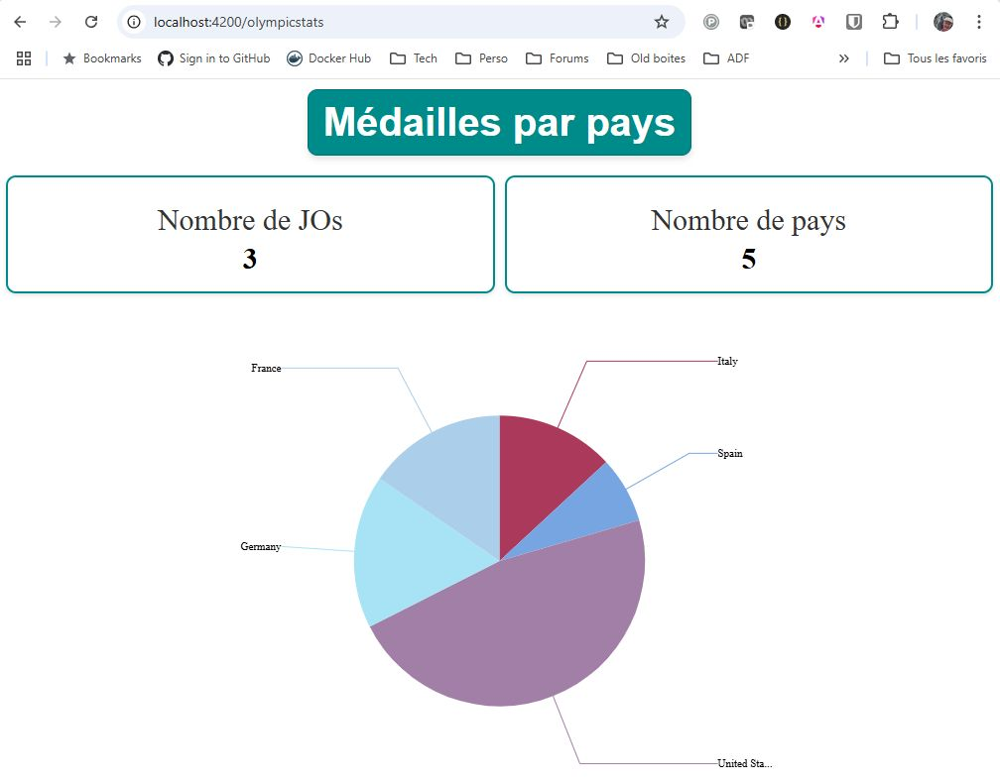
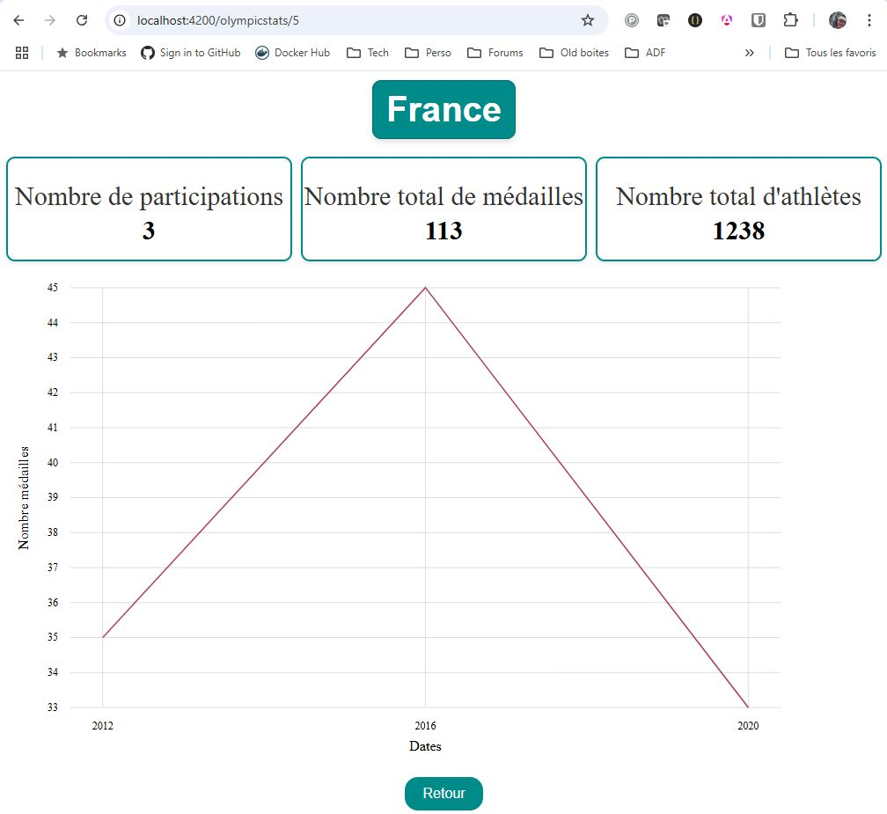

# Application Jeux Olympiques 

## Table des matières
- [Auteur et dépôts](#auteur-et-dépôts)
- [Description](#description)
- [Fonctionnalités](#fonctionnalités)
- [Composants Réutilisables](#composants-réutilisables)
- [Composants de services partagés (réactifs)](#composants-de-services-partagés-réactifs)
- [Pages](#pages)
- [Démo](#démo)
- [Screenshots](#screenshots)
- [Prérequis pour l'installation](#prérequis-pour-linstallation)
- [Installation](#installation)
- [Démarrage du projet](#démarrage-du-projet)
- [Architecture du projet](#architecture-du-projet)
- [Commandes disponibles](#commandes-disponibles)
- [Contributions](#contributions)
- [Licence](#licence)


## Auteur et dépôts
- Auteur : Christophe Pierrès 
- Dans le cadre du projet N°2 d'OpenClassrooms (premier projet Angular), en vue d'obtenir la certification **Expert en développement logiciel**. Plus d'informations disponibles [ici](https://www.francecompetences.fr/recherche/rncp/36912/)
- Dépôt GitHub des sources : https://github.com/cpierres/Opencr-Projet02-Angular
- Documentation technique (compodoc) : https://cpierres.github.io/Opencr-Projet02-Angular/

Cette application a été développée en utilisant Angular (version 18.0.3) et vise à fournir une expérience interactive pour explorer 
les données et fonctionnalités liées aux Jeux Olympiques pour le compte de la société Télésport. 

## Description

L'application des Jeux Olympiques est conçue pour :
- Explorer les performances des pays participants à travers des graphiques et des données interactives.
- Afficher des informations détaillées sur les éditions des Jeux Olympiques.
- Fournir un cadre extensible pour ajouter de nouvelles fonctionnalités.
- L'application est entièrement **responsive**, s'adaptant aux différents types d'écrans (ordinateurs, tablettes, mobiles).
- Les données et interactions sont **réactives**, permettant une mise à jour en temps réel.
---

## Fonctionnalités

- **Visualisation de données** : exploration des statistiques des Jeux Olympiques via des graphiques et des interfaces dynamiques.
- **Navigation intuitive** : une structure bien organisée pour accéder aux différentes pages et fonctionnalités.
- **Extensibilité** : base de code modulaire et facilement évolutive.

---

## Composants Réutilisables

Voici les principaux composants réutilisables utilisés dans le projet Angular :
- **BoxStatsComponent** : Permet d'afficher des boites de statistiques (1 titre et n boites de stat. avec libellé et valeur) 
- **GlobalGraphComponent** : Permet de visualiser un graphique global concernant les statistiques des Jeux Olympiques.
- **DetailGraphComponent** : Affiche les détails spécifiques d'un pays pour les Jeux Olympiques.
Ces composants peuvent être instanciés dans différents contextes.

## Composants de services partagés (réactifs)

- **LoadingComponent** et **LoadingService** : pour faire patienter l'utilisateur lors du chargement d'un flux. La méthode `showLoaderUntilCompleted<T>(observable$: Observable<T>): Observable<T>` permet de greffer le loading sur un Observable sans être intrusif. 
- **MessagesService** : pour gérer les messages erreurs affichés à l'utilisateur.


## Pages
- **HomeComponent** : Page d'entrée du tableau de bord olympique, servant de point de départ pour explorer les fonctionnalités.
- **OlympicCountryDetail** : Page de détail des statistiques par pays, pour gérer la navigation et inclure le composant ci-dessous.
- 
## Démo

- **Serveur de développement** : `http://localhost:4200/`

## Screenshots

### Homepage Dashboard
Page d'accueil avec possibilité de drill-down sur un pays afin d'accéder à l'écran détail.


### Detail Country
Page détaillant les performances d'un pays spécifique.



---

## Prérequis pour l'installation

### 1. Installer **nvm** (Node Version Manager)

Nous recommandons d'utiliser [nvm](https://github.com/nvm-sh/nvm) pour gérer les versions de Node.js installées sur votre machine, afin de simplifier la gestion des dépendances et des versions.

**Étapes :**
1. Téléchargez et installez `nvm` depuis sa [documentation officielle](https://github.com/nvm-sh/nvm#installing-and-updating).
2. Une fois installé, utilisez la commande suivante pour installer la version de Node.js utilisée par ce projet :

   ```bash
   nvm install
   ```

   Cette commande lira automatiquement le fichier `.nvmrc` situé dans la racine du projet et installera la version recommandée de Node.js.
3. Ensuite, activez cette version avec :

   ```bash
   nvm use
   ```

---

### 2. Ne pas installer Angular CLI globalement

Nous déconseillons d'installer Angular CLI de manière globale pour éviter les conflits entre versions lorsque vous travaillez sur plusieurs projets. Une solution consiste à utiliser `npx` pour exécuter Angular CLI directement sans installation globale.

---

## Installation

1. Clonez le dépôt sur votre machine :
   ```bash
   git clone https://github.com/cpierres/Opencr-Projet02-Angular.git
   cd Opencr-Projet02-Angular
   ```
2. Installez les dépendances en exécutant :
   ```bash
   npm install
   ```

---

## Démarrage du projet

1. Pour lancer l'application en mode développement, utilisez la commande suivante (en passant par `npx`) :
   ```bash
   npx ng serve
   ```
   Cette commande utilise la version de CLI Angular installée localement dans le projet.

2. Ouvrez votre navigateur à l'adresse suivante :
   [http://localhost:4200/](http://localhost:4200/)

---

## Architecture du projet

L'architecture de ce projet est conçue pour faciliter la lisibilité et l'évolutivité du code.

### Structure

- **`components/`** : Contient tous les composants réutilisables.
- **`pages/`** : Composants spécifiques aux pages (liées aux routes définies).
- **`core/`** :
  - **`services/`** : Services Angular gérant la logique métier (inclut `olympic.service.ts`).
  - **`models/`** : Définitions des interfaces Typescript pour la gestion des données (exemple : données issues de `olympic.json`).
    - **`stats/`** : Structures utilitaires pour les affichages statistiques et graphiques.

### Points d'entrée importants

- **Fichier de routage** : `app-routing.module.ts`
- **Service principal** : `olympic.service.ts`

Il est conseillé de commencer par comprendre ces fichiers avant d'ajouter de nouvelles fonctionnalités.
A noter que l'application conserve la structure de départ avec ngModule (starter code d'openclassrooms).
Néanmoins les composants réutilisables sont développés en Standalone.
Une évolution possible serait une migration totale en standalone mais ceci n'est pas demandé dans le projet.

---

## Commandes disponibles

Toutes les commandes du projet peuvent être exécutées via `npx`, garantissant ainsi l'utilisation de la version locale de CLI Angular configurée pour le projet.

### Lancer le serveur de développement
```bash
npx ng serve
```

### Construire le projet (pour un déploiement)
```bash
npx ng build
```
---

## Contributions

Les contributions sont les bienvenues ! Si vous souhaitez contribuer :
1. Forkez ce dépôt.
2. Travaillez sur une nouvelle branche.
3. Soumettez une *Pull Request* avec une description détaillée de vos modifications.

---

## Licence

Ce projet est sous licence MIT.

## Dépendance principale

- **ngx-charts** : Bibliothèque Angular pour la création de graphiques interactifs et visuellement attractifs. Plus d'informations disponibles [ici](https://github.com/swimlane/ngx-charts).

---


## Auteur et contributeur

- [Christophe Pierrès](https://github.com/cpierres)  
- Rachid Oubraim, mentor d'OpenClassrooms
